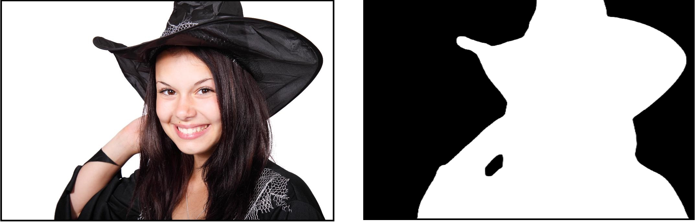
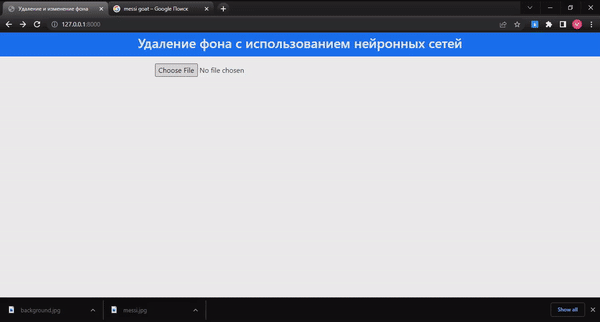

# Удаление фона с помощью нейронных сетей

<p align="justify">В данной работе разработан подход к удалению фона человеческих изображений. Основная идея состоит в том, что человеческие изображения сегментированы с помощью архитектуры DeepLabV3+. Весь код написан на Питоне, с использованием библиотеки TensorFlow. Реализован простейший веб интерфейс (использовать fastapi) с интеграцией через api (на вход поступает изображение) на выходе изображение с удаленным фоном.</p>

## Содержание

- Семантическая сегментация
- Данные
- Обработка данных
- Построение нейронных сетей DeepLabv3+/ResNet50
- Обучение модель
- Оценка по модели
- Простейший веб интерфейс для удаления фона

## Семантическая сегментация

<p align="justify">Семантическая сегментация - хорошо известная задача компьютерного зрения, одна из трех важнейших, наряду с классификацией и обнаружением объектов. Сегментация, на самом деле, является задачей классификации, в смысле распределения каждого пикселя по классам. В отличие от моделей классификации или обнаружения изображений, модель сегментации действительно демонстрирует некоторое «понимание» изображений, то есть не только говорит, что «на этом изображении есть кошка», но и на уровне пикселей указывает, где эта кошка.</p>
<p align="justify">Проведя некоторые исследования, я остановились на четырех доступных моделях: FCN, Unet, Tiramisu и DeepLabV3+.</p>
<p align="justify">Одна из самых простых и популярных архитектур, используемых для семантической сегментации, это полносверточная сеть (Fully Convolutional Network, FCN). В статье <a href = "https://arxiv.org/pdf/1411.4038.pdf"> "Fully Convolutional Networks for Semantic Segmentation" </a> авторы используют FCN для первоначального преобразования входного изображения до меньшего размера (одновременно с этим увеличивая количество каналов) через серию сверток. Такой набор сверточных операций обычно называется кодировщик (энкодер). Затем выход декодируется или через билинейную интерполяцию (билинейный апсамплинг), или через серию транспонированных сверток, который носит название декодер. FCN не казалась актуальной, так как её результаты были не столь хороши по сравнению с другими моделями.</p>
<p align="justify"><a href = "https://arxiv.org/pdf/1505.04597.pdf">Сеть U-Net</a> представляет из себя улучшение простой FCN архитектуры. Эта сеть была создана в 2015 году для сегментации биомедицинских изображений. Архитектура сети представляет собой полносвязную свёрточную сеть, модифицированную так, чтобы она могла работать с меньшим количеством примеров (обучающих образов) и делала более точную сегментацию.</p>
<p align="justify"><a href = "https://arxiv.org/pdf/1611.09326.pdf">Модель Тирамису</a> похожа на U-Net за исключением того, что для прямой и транспонированной свертки здесь используются плотные блоки, как показано в работе <a href = "https://arxiv.org/pdf/1608.06993.pdf">DenseNet </a>. Плотные блоки состоят из нескольких сверточных слоев, где в качестве входов на последующие слои используются отображения признаков со всех предыдущих слоев. Результирующая сеть чрезвычайно эффективна в смысле параметров и может лучше работать с признаками из старых слоев.</p>
<p align="justify">Одна из недавних моделей, которая хорошо показала себя на задаче семантической сегментаций на разных датасетах - <a href = "https://arxiv.org/pdf/1802.02611v3.pdf">DeepLabv3+</a>. DeepLabV3+ — это современная модель глубокого обучения для семантической сегментации изображений, целью которой является присвоение семантических меток (таких как человек, собака, кошка и т. д.) каждому пикселю входного изображения. Модель DeepLabV3+ имеет фазу кодирования (фаза энкодера) и фазу декодирования. Фаза кодирования извлекает существенную информацию из изображения с помощью сверточной нейронной сети (CNN), тогда как фаза декодирования реконструирует выход соответствующих размеров на основе информации, полученной из фазы энкодера. Модуль декодера был добавлен для получения лучших результатов сегментации вдоль границ объектов.
<p align="center">
  
</p>
<p align="center">Структура сети DeepLabV3+</p>
<p align="justify">В данной работе построена модель на основе алгоритма DeepLabV3+ со энкодером на базе ResNet50, а также с  дополнительным компонентом, позволяющим повысить точность сегментации и сократить время вывода (блоками Squeeze & Excitation) (<a href = "https://keras.io/examples/vision/deeplabv3_plus/">пример</a>).</p> 

## Данные
<p align="justify">Для задачи сегментации человеческого изображения нам нужен набор данных с человеческими изображениями и с правильно аннотированными масками. Здесь я собираюсь использовать набор данных "Person Segmentation" (https://www.kaggle.com/nikhilroxtomar/person-segmation>). Набор данных состоит из 5678 изображений и масок.</p>
<p align="center">
  
<br>Пример изображения с маском из датасета </p>
<p align="justify">
Датасет состоит из трех павки:  
<ul>
  <li> images - содерживает изображения </li>
  <li> masks - содерживает маски </li>
  <li> segmentation - содерживает 3 файла .txt с названиями изображений и масок</li>
</ul>
</p>

## Обработка данных
<p align="justify">Весь код для обработки данных будет в файле <b>data_processing.py</b>. Сначала я разделил датасет на тренировочную и тестовую выборки (по отношение 9:1). Затем проводил аугментации для тренировочной выборки с помощью библиотеки Albumentations. у нас изображения по разному размеру, поэтому надо изменить размер изображений и масок в одиноковую формулу (512 х 512 пикселей).  
  Я создал еще 5 дополнительных изображений/масок по разным фунцкиям:
  <ul>
  <li>Albumentations.HorizontalFlip(p=1) - горизонтальный флип;</li>
  <li>сv2.cvtColor(x, cv2.COLOR_RGB2GRAY) - преобразование цветных изображений RGB в изображения в оттенках серого;</li>
  <li>Albumentations.ChannelShuffle(p=1) - случайным образом переупорядочить каналы входного RGB-изображения;</li>
  <li>Albumentations.Blur(blur_limit=7, p=1) - размытие входного изображений;</li>
  <li>Albumentations.Rotate(limit=45, p=1.0) - вращение изображений и масок на 45 градусов .</li>
</ul>
</p>

## Построение нейронных сетей DeepLabv3+/ResNet50
<p align="justify">Весь код для построения нейронных сетей в файле <b>model.py</b>. Сеть начинается с предварительно обученного ResNet50 в качестве кодера, за которым следует Atrous Spatial Pyramid Pooling (ASPP). ASPP состоит из расширенной свертки, которая помогает кодировать многомасштабную контекстную информацию. Затем за ней следует билинейный апсамплинг (bilinear upsampling) в 4 раза, а затем соединяется с низкоуровневой информацией из энкодера. После этого применяется несколько 3×3 свертки и снова следует билинейная апсамплинг в 4 раза. Наконец-то мы получаем выходную маску.
</p>
<p align="justify">Функция для структуры Atrous Spatial Pyramid Pooling (ASPP):</p>

```ruby
def ASPP(inputs):  
     """ Image Pooling """
  shape = inputs.shape
  y1 = AveragePooling2D(pool_size=(shape[1], shape[2]))(inputs)
  y1 = Conv2D(256, 1, padding="same", use_bias=False)(y1)
  y1 = BatchNormalization()(y1)
  y1 = Activation("relu")(y1)
  y1 = UpSampling2D((shape[1], shape[2]), interpolation="bilinear")(y1)
     """1x1 conv"""
  y2 = Conv2D(256, 1, padding="same", use_bias=False)(inputs)
  y2 = BatchNormalization()(y2)
  y2 = Activation("relu")(y2)
      """ 3x3 conv rate=6 """
  y3 = Conv2D(256, 3, padding="same", use_bias=False, dilation_rate=6)(inputs)
  y3 = BatchNormalization()(y3)
  y3 = Activation("relu")(y3)
      """ 3x3 conv rate=12 """
  y4 = Conv2D(256, 3, padding="same", use_bias=False, dilation_rate=12)(inputs)
  y4 = BatchNormalization()(y4)
  y4 = Activation("relu")(y4)
      """ 3x3 conv rate=18 """
  y5 = Conv2D(256, 3, padding="same", use_bias=False, dilation_rate=18)(inputs)
  y5 = BatchNormalization()(y5)
  y5 = Activation("relu")(y5)
  
  y = Concatenate()([y1, y2, y3, y4, y5])
  y = Conv2D(256, 1, padding="same", use_bias=False)(y)
  y = BatchNormalization()(y)
  y = Activation("relu")(y)
  return y
```
<p align="justify">Функция для полной структуры DeepLab3V+:</p>

```ruby
 def deeplabv3_plus(shape):  
  """ Input """
  inputs = Input(shape)  

  """ Encoder """
  encoder = ResNet50(weights="imagenet", include_top=False, input_tensor=inputs)  

  image_features = encoder.get_layer("conv4_block6_out").output  
  x_a = ASPP(image_features)  
  x_a = UpSampling2D((4, 4), interpolation="bilinear")(x_a)  

  x_b = encoder.get_layer("conv2_block2_out").output  
  x_b = Conv2D(filters=48, kernel_size=1, padding='same', use_bias=False)(x_b)  
  x_b = BatchNormalization()(x_b)  
  x_b = Activation('relu')(x_b)  

  x = Concatenate()([x_a, x_b])  
  x = SqueezeAndExcite(x)

  x = Conv2D(filters=256, kernel_size=3, padding='same', use_bias=False)(x)
  x = BatchNormalization()(x)
  x = Activation('relu')(x)

  x = Conv2D(filters=256, kernel_size=3, padding='same', use_bias=False)(x)
  x = BatchNormalization()(x)
  x = Activation('relu')(x)
  x = SqueezeAndExcite(x)

  x = UpSampling2D((4, 4), interpolation="bilinear")(x)
  x = Conv2D(1, 1)(x)
  x = Activation("sigmoid")(x)

  model = Model(inputs, x)
  return model
  ```
  ## Обучение модели
  
  <p align="justify"> Использовать Google Colaboratory для тренировки нейросетей, т.к у меня нет компьютера с мощным процессором. Код написан файле <b>train.ipynb</b>.  Google Colaboratory дает возможность бесплатно и непрерывно пользоваться ими на протяжении 12 часов, поэтому надо сохранить модель или ее весов в процессе обучения с помощью функции обратного вызова ModelCheckpoint.</p>
 
 ```ruby
  callbacks = [
    ModelCheckpoint(model_path, verbose=1, save_best_only=True),
    ReduceLROnPlateau(monitor='val_loss', factor=0.1, patience=5, min_lr=1e-7, verbose=1),
    CSVLogger(csv_path),
    TensorBoard(),
    EarlyStopping(monitor='val_loss', patience=20, restore_best_weights=False),
]
  ```
<p align="justify"> После несколько часов модель успешно обучена, получен файл <b>model.h5</b>.</p>

  ## Оценка по модели

<p align="justify"> Я собираюсь оценить модель по различным метрикам, чтобы проверить ее эффективность обобщения. нужно импортировать функции Accure_SCORE, F1_SCORE, Jaccard_SCORE, PRECISION_SCORE и EMPLECT_SCORE из библиотеки Sklearn. Эти метрики используются для оценки модели для ее возможности обобщения (код написан в файле <b>eval.py</b>. получены последние средние оценки для всех метрик и сохраняем все отдельные оценки в файле <b>score.csv</b>.</p>
<ul>
  <li> Accuracy: 0.97158 </li>
  <li> F1: 0.93898 </li>
  <li> Jaccard: 0.90440 </li>
  <li> Recall: 0.94054 </li>
  <li> Precision: 0.95179 </li>
 </ul>

  ## Простейший веб интерфейс для удаления фона
  
  <p align="justify"> Я реализовал простейший веб интерфейс (использовать fastapi), с интеграцией через api (на вход поступает изображение) на выходе изображение с удаленным фоном. Кроме того, можно изменить фона изображения.
<p align="justify">Запуска веб-приложения:</p>

  ```ruby
  uvicorn app:app --host 127.0.0.1 --port 8000
   ```
 <p align="center">
  
  <br>Demo веб-удаления фона</p>
</p>
